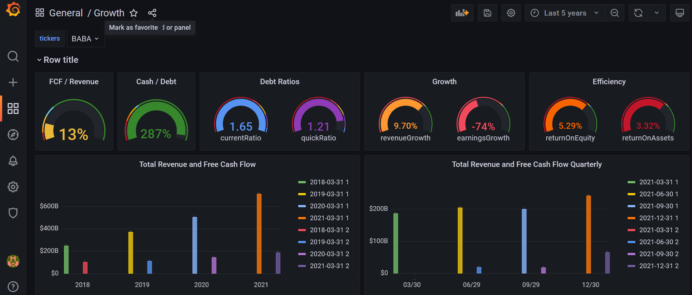

Stock Analysis
___

- [1. App](#1-app)
- [2. Results](#2-results)
- [3. Architecture](#3-architecture)
- [4. Pre requisites](#4-pre-requisites)
- [5. Config Files](#5-config-files)
- [6. Installation](#6-installation)
- [7. Set-UP Grafana](#7-set-up-grafana)
- [8. Future Actions](#8-future-actions)

___


## 1. App

The intent of this application is to use some programming and infra knowledge trying to make something that can be of real value.

In this specific case the code collects stock data from Yahoo websites, parse the data and upload it to a local Database.
Then it uses a dashboard tool that is possible to create queries using many different criteria do analyze your stocks

## 2. Results

It may be not appealing to get in the details before showing the results.
So this is what can be achieved what the current code.

The idea is not to provide a complete suite, but the base on which advanced concepts can be built.



## 3. Architecture

Containers:
- stock_db (Postgres)
  - This container will store the scraped data

- stock_dashboard (Grafana)
  - This container show the data in graphic mode

- stock_engine (Python Code)
  - Code responsible for scraping and uploading data


## 4. Pre requisites

Have installed

- [ ] Docker
- [ ] Docker Compose
- [ ] Git

## 5. Config Files

- docker/stock-app/src/config/app_config.conf
  - Configure APP main parameters such as DB and threading.
  - You can use default

- docker/stock-app/src/config/schema.yml
  - The list of tickers to be monitored

## 6. Installation

```shell
# Pull the code
git clone https://github.com/danielnegreiros/stock-analysis.git
cd ./stock-analysis/docker/

# Run containers
docker-compose build
docker-compose up -d

# Check logs
docker logs stock_engine
```

## 7. Set-UP Grafana

- Open Grafana webpage (localhost or your host IP)
```text
  http://localhost:3000/

  username: admin
  passwd: admin
```

- Add Postgres data source with the following info

```text
  HOST = stock_db
  Database = stock_db
  user = postgres
  pass = postgrespass
  TLS/SSL Mode = disable

  Save and Test
```


- Add the template from Grafana directory (Optional)

```text
  This is a template for demonstration only.
  On Grafana click in + then IMPORT

  Copy the content from grafana/dashboard.json and paste it in Import via panel json

  Click in Load
  Click in Import
```

## 8. Future Actions

- [ ] Refactor Code
- [ ] Create API Server for tickers management
- [ ] Crete CLI for ticker management
- [ ] Add Prometheus for app monitoring
- [ ] Add Prometheus for stock price alert
- [ ] Add more relevant templates
